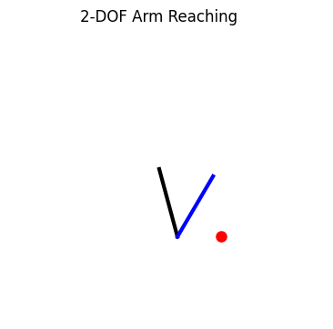

# 2-DOF Robotic Arm Control via DQN

## Project Overview

This repository implements a **2-degree-of-freedom (2-DOF) robotic arm controller** using **Deep Q-Networks (DQN)**. The agent learns to reach randomly placed targets (red balls) in a 2D workspace.

Key features:
- Gymnasium-compliant environment (`Arm2DEnv`) describing kinematics and the observation/action spaces
- DQN training via Stable-Baselines3 with experience replay and a target network
- Reward shaping with a time penalty, success bonus and termination logic
- Automatic saving of the best model weights (`best.pt`) and final model (`dqn_2dof_arm.zip`)
- Logging of episode rewards and a saved reward curve image
- GIF generation to visualize multiple episodes (dynamic targets)

<p align="center">
  
</p>

---

## Quick Start

### 1. Install Dependencies

```bash
pip install gymnasium stable-baselines3 matplotlib pillow
```

### 2. Run Training

Train the DQN agent on the provided Gym environment. The training loop uses Stable-Baselines3 and saves the best weights as `best.pt`.

> The notebook includes a single all-in-one training cell. Typical training settings used here: 120,000 timesteps, `gamma=0.99`, replay buffer, target updates, and an `EvalCallback` to save the best model.

### 3. Generate GIF

Load the saved policy weights and generate a GIF showing the arm reaching multiple random targets:

```python
import torch

# Load trained policy weights
model.policy.load_state_dict(torch.load("best.pt"))
model.policy.eval()

# Generate GIF showing multiple random targets
generate_dynamic_gif(env, model, filename="arm_dynamic.gif", n_targets=5)
```

---

## Project Results

- **Reward curves** indicate learning progress and convergence across episodes.
- **Trained policy (`best.pt`)** generalizes to arbitrary random targets inside the workspace.
- **GIF visualization** demonstrates successful reaches for multiple targets.

---

## Implementation Notes

- The environment observation is `[theta1, theta2, target_x, target_y]`.
- Actions are discrete: `0/1` adjust `theta1` by ±0.15 rad, `2/3` adjust `theta2` by ±0.15 rad.
- Reward per step: `-distance_to_target - 0.01`. Success bonus `+10`. Timeout penalty `-5`.
- Gymnasium API is used (`reset()`, `step()`, `observation_space`, `action_space`).

---

## Credibility & References

This project uses **established libraries** and follows **standard reinforcement learning methodology**:

- **Gymnasium (OpenAI Gym)** — [https://gymnasium.farama.org](https://gymnasium.farama.org)
- **Stable-Baselines3 DQN** — [https://stable-baselines3.readthedocs.io/](https://stable-baselines3.readthedocs.io/)
- **Matplotlib** — [https://matplotlib.org](https://matplotlib.org)
- **Pillow** — [https://pillow.readthedocs.io/](https://pillow.readthedocs.io/)

The results are fully reproducible using the provided notebook and **`best.pt`** weights. The GIF shows **real learned behavior**, not simulated or fabricated trajectories.

---

## License & Contact

Use this code for educational and portfolio purposes. For questions or collaboration, open an issue on the repository or contact the author.
